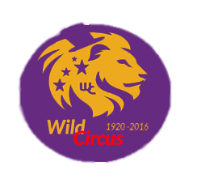
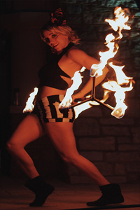

# wild-circus-deathcore40
<!doctype html>
<html>
<head>
<meta http-equiv="Content-Type" content="text/html; charset=utf-8" />
<title>Wild Circus</title>

<link rel="stylesheet" href="css/styles.css" type="text/css" />

</head>
<body>

<a href="#"<a/>

    <header> 
	

		<nav>
	
    			<ul class="sf-menu dropdown">

			
        			<li class="selected"><a href="index.html">Home</a></li>

            			<li>

					<a href="#">Shows & Ticket</a>
            			
					<ul>
                		<li><a href="#">Merchandising</a></li>
			<li><a href="#">Tickets</a></li>
			<li><a href="#">What's New</a></li>
                			</ul>

            			</li>

	     			<li><a href="#">All Shows</a>

							<ul>
             <li><a href="#">Los Angeles</a></li>
			<li><a href="#">Las Vegas</a></li>
			<li><a href="#">Washington DC</a></li>
			<li><a href="#">New York City</a></li>
                			</ul>

	     			</li>
            
				<li>

					<a href="#">WORK WITH US </a>
            				
					<ul>
            <li><a href="#">Exclusive video </a></li>
			<li><a href="#">Newsletters</a></li>
			<li><a href="#">Team</a></li>
			<li><a href="#">History</a></li>
                			</ul>

            			</li>
            
				<li><a href="#">Events</a>

						<ul>
             <li><a href="#">Special Projects</a></li>
			<li><a href="#">Fire-eater</a></li>
			<li><a href="#">Contemporary Dance</a></li>
			<li><a href="#">Illusionists</a></li>
                			</ul>

				</li>
       			</ul>

			
			

    		</nav>
       	

	

       
    </header>

    

	

      
		

	
                    <h2><a href="/">Welcome to Wild Circus</a></h2>
                
                                  	

            	

                
            

            

	

    

		<section id="content" class="two-column with-right-sidebar">

	    <article>
				
			
			<h2>Shows by Circus</h2>
			
Posted on <time datetime="20/11/2016">25 November</time> by Wild Team

			

            
<firstletter>S</firstletter>pecial projects and exclusive around the world.  At the core of all our prestigious events is Wild Circus unique wealth of creative excellence and expertise.  Our projects combine Wild Circus creative resources with external designers and specialized  technical experts, tapping into the greatest creative talent pool both locally and internationally.

			

        
		<a href="#" class="button">Read more</a>
		<a href="#" class="button button-reversed">Comments</a>

		
		</article>
	
		<article class="expanded">

            		<h2>An astounding show of flames</h2>
			
Posted on <time datetime="2013-05-14">4 december</time> by <a href="#" rel="author">Natacha our artist</a>

			
           

			<!-- Top Navigation -->
			<header class="codrops-header">
				
			
				

					<figure class="effect-X">
						
						<figcaption>
						
							
							<a href="#">View more</a>
						</figcaption>			
					</figure>
					<figure class="effect-X">
						
						<figcaption>
						
					
							<a href="#">View more</a>
						</figcaption>			
					

		<a href="#" class="button">Read more</a>
		<a href="#" class="button button-reversed">Comments</a>
		</article>
        </section>
        
        <aside class="sidebar big-sidebar right-sidebar">
	
                        

            <ul>	
               <li>
                    <ul class="blocklist">
                        <li><a class="selected" href="#">Corporate</a></li>
                        <li><a href="#">Corporate Partnership</a>
				<ul>
					<li><a href="#">Jobs</a></li>
					<li><a href="#">Citizenship</a></li>
					<li><a href="#">One Drop</a></li>
				</ul>
			</li>
                       
                    </ul>
                </li>
                

                 <ul>	
               <li>
                    <ul class="blocklist">
                        <li><a class="selected" href="#">About Us</a></li>
                        <li><a href="#">Latest News</a>
				<ul>
					<li><a href="#">Press Room</a></li>
					<li><a href="#">Headquarters</a></li>
					<li><a href="#">Creative Process</a></li>
					<li><a href="#">Past Shows</a></li>
				</ul>
			</li>
                       
                    </ul>
                </li>
                

		
               
                <li>
			<h4>Social Network</h4>
			<ul class="newslist">
				<li>
					
	

	
   		
		
        </aside>
    	

    

   <footer>

<a href="#">Contact Us |</a>
<a href="#">Terms and Conditions | </a>
 <a href="#">Privacy Policy | </a>
 <a href="#">Sitemap </a>
 
    </footer>
</body>
</html>
